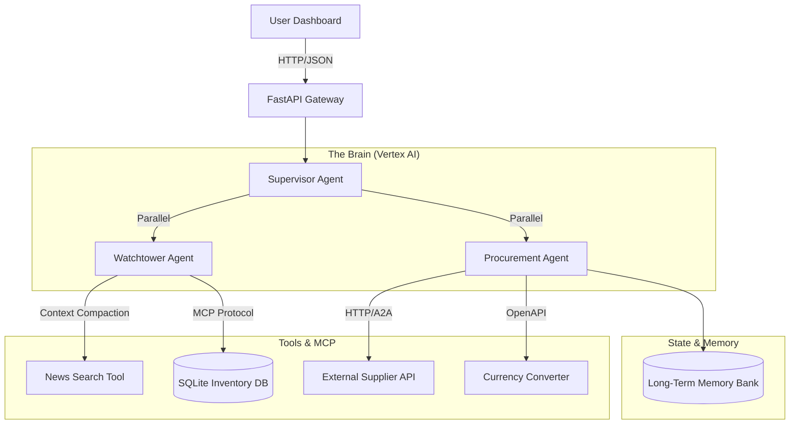

# Multi-Agent Supply Chain Resilience System
### Autonomous Supply Chain Resilience System


---

## 🚀 The Pitch
Modern supply chains are fragile. When a disruption (e.g., Earthquake in Taiwan) occurs, human teams take **3-5 days** to assess impact, verify inventory, and negotiate with backup suppliers.

**Sentinell.ai** is an agentic system that reduces this Mean Time to Recovery (MTTR) from **days to seconds**.

It autonomously:
1.  **Detects Risks:** Monitors global news for disruptions (e.g., "Port Strikes").
2.  **Analyzes Impact:** Correlates external events with internal inventory databases.
3.  **Negotiates Solutions:** Uses the **A2A (Agent-to-Agent)** protocol to autonomously negotiate price and quantity with backup suppliers.
4.  **Enforces Compliance:** Pauses for "Human-in-the-Loop" approval only when costs exceed pre-defined safety thresholds.

---

## 💼 Business Impact & Value

**Sentinell.ai** is not just a chatbot; it is a **Resilience Engine** designed to solve a multi-billion dollar problem: **Supply Chain Fragility.**

In a traditional workflow, recovering from a disruption (like a port strike) is a manual, sequential process involving emails, spreadsheets, and phone calls. This latency costs manufacturers millions in "Line Down" charges.

**The Sentinell Advantage:**

| Metric | Traditional Human Workflow | Sentinell.ai Agentic Workflow | **Impact** |
| :--- | :--- | :--- | :--- |
| **Detection Speed** | **Hours/Days** (Depends on news cycle) | **Seconds** (Real-time monitoring loop) | ⚡ **99% Faster** |
| **Analysis Depth** | Manual cross-referencing of Excel vs. News | Automated MCP Database Query correlating Event + Inventory | 🧠 **Zero Cognitive Load** |
| **Response Time** | **Days** (Email negotiations) | **Milliseconds** (A2A Protocol negotiation) | 🚀 **Instant Execution** |
| **Compliance** | prone to human error / bypass | Hard-coded Logic Gates (Budget Pause > $5k) | 🛡️ **100% Policy Adherence** |

**Real-World Application:**
By automating the "OODA Loop" (Observe, Orient, Decide, Act), Sentinell allows Supply Chain Managers to shift focus from **fighting fires** to **strategic decision making**.

---
## 🏗️ Architecture

The system follows a microservices-based, multi-agent architecture deployed on **Google Cloud Run**.



---

## ✨ Key Features

#### 1. Multi-Agent System
* **Loop Agent (Watchtower)**: Implements a ReAct loop (Observation -> Thought -> Action) to investigate risks iteratively.
* **Parallel Agent (Supervisor)**: Spawns concurrent threads to analyze Political and Weather risks simultaneously (reducing latency by ~50%).
* **Sequential Agent (Procurement)**: Follows a strict compliance workflow (Memory Check -> Quote -> Approval -> Order).

#### 2. Advanced Tooling
* **MCP Integration**: Uses the Model Context Protocol to safely query the internal Inventory Database.
* **OpenAPI Tools**: Consumes a standardized REST API for real-time Currency Conversion.
* **A2A Protocol**: Implements a Client/Server architecture where the Procurement Agent negotiates with a separate Supplier Agent over HTTP.

#### 3. Cognitive Capabilities
* **Context Engineering**: Uses a lightweight LLM (Flash) to "compact" noisy news search results into high-density summaries before reasoning.
* **Long-Term Memory**: Persists supplier reliability scores. If a supplier fails a delivery, the agent "remembers" and avoids them in future sessions.
* **Human-in-the-Loop**: Automatically pauses execution for high-value transactions (> $5,000) to request user approval.

#### 4. Enterprise Grade (DevOps & AIOps)
* **Observability**: Full OpenTelemetry instrumentation traces every "Thought" and "Tool Call" through the system.
* **CI/CD**: GitHub Actions pipeline automatically runs tests and deploys to Cloud Run on push.
* **Infrastructure as Code**: All cloud resources provisioned via Terraform.

---

## 🛠️ Tech Stack
* **AI Core**: Google Vertex AI (Gemini 2.5 Flash-Lite), Google ADK.
* **Backend**: Python 3.11, FastAPI, Uvicorn (Multi-worker).
* **Frontend**: Next.js 14, TypeScript, Tailwind CSS, CopilotKit.
* **Data**: SQLite (Inventory), JSON (Memory Bank).
* **DevOps**: Docker, Google Cloud Build, Terraform, OpenTelemetry.

---

## ⚡ Getting Started
Follow these steps to replicate the project in a fresh environment (e.g., GitHub Codespaces or Local Machine).

### 0. Prerequisites & Cloud Setup
* Google Cloud Project with **Vertex AI API** enabled.
* Python 3.11+ & Node.js 18+.

**⚠️ Important for GitHub Codespaces:**
If running in a fresh Codespace, you must first install the Google Cloud CLI and authenticate. Run these commands in your terminal:

```bash
# 1. Install gcloud CLI (Required for Codespaces)
sudo apt-get update && sudo apt-get install -y apt-transport-https ca-certificates gnupg
echo "deb [signed-by=/usr/share/keyrings/cloud.google.gpg] [https://packages.cloud.google.com/apt](https://packages.cloud.google.com/apt) cloud-sdk main" | sudo tee -a /etc/apt/sources.list.d/google-cloud-sdk.list
curl [https://packages.cloud.google.com/apt/doc/apt-key.gpg](https://packages.cloud.google.com/apt/doc/apt-key.gpg) | sudo apt-key --keyring /usr/share/keyrings/cloud.google.gpg add -
sudo apt-get update && sudo apt-get install -y google-cloud-cli

# 2. Authenticate with Google Cloud
# Follow the link, login, and paste the code back into the terminal.
gcloud auth application-default login
```

### 1. Clone & Setup

```bash
git clone https://github.com/abhinandansamal/Multi-Agent-Supply-Chain-Resilience-System.git

cd Multi-Agent-Supply-Chain-Resilience-System
```

### 2. Backend Setup
```bash
cd backend
python -m venv venv
source venv/bin/activate  # or venv\Scripts\activate on Windows
pip install -r requirements.txt

# --- Configuration ---
# REPLACE 'your-project-id' with your actual Google Cloud Project ID (e.g., sentinell-supply-chain)
echo "GOOGLE_CLOUD_PROJECT=your-project-id" > .env
echo "GOOGLE_CLOUD_REGION=us-central1" >> .env
echo "LOG_LEVEL=INFO" >> .env

# --- Initialization ---
# Create the SQLite database and seed mock data
python src/tools/generate_data.py

# --- Run Server ---
# Starts the API on http://localhost:8080
python -m src.main
```

### 3. Frontend Setup
Open a new terminal (keep the backend running) to set up the Dashboard.

```bash
cd ../frontend
npm install

# --- Connect to Backend ---
# OPTION A: If you have deployed to Cloud Run (Use your Terraform/Cloud Run URL)
# echo "NEXT_PUBLIC_API_URL=https://your-cloud-run-url.a.run.app" > .env.local

# OPTION B: If running locally in Codespaces/Localhost
# Note: In Codespaces, ensure port 8080 is public or use the localhost address
echo "NEXT_PUBLIC_API_URL=http://localhost:8080" > .env.local

# --- Run Dashboard ---
npm run dev
```

---

## 🧪 Testing & Evaluation
We use a "Golden Dataset" to validate Agent decision-making accuracy.
```bash
cd backend
# Runs 3 scenarios: Taiwan (Critical), Vietnam (Low), USA (Medium)
pytest tests/test_agents.py -v
```

---

## 📦 Deployment (Cloud Run)
The project includes a fully automated CI/CD Pipeline.

1. Push code to main branch.

2. GitHub Actions triggers:

    * Runs Unit Tests (`pytest`).
    * Builds Docker Container via Cloud Build.
    * Deploys to **Google Cloud Run**.

**Manual Deployment via Terraform:**
```bash
cd infrastructure/terraform
terraform init
terraform apply
```

---

## 📂 Repository Structure

```text
multi-agent-supply-chain-resilience-system/
├── .github/workflows/         # CI/CD Pipeline definitions
│   └── deploy.yaml            # GitHub Actions workflow for testing & deployment
├── backend/                   # Python/FastAPI Agentic Backend
│   ├── data/                  # Local data persistence
│   │   ├── agent_memory.json  # Long-term memory storage
│   │   └── supply_chain.db    # Inventory SQLite database
│   ├── src/                   # Source Code
│   │   ├── a2a/               # Mock Supplier Service (Agent-to-Agent)
│   │   ├── agents/            # Core Agent Logic (Watchtower, Procurement, Supervisor)
│   │   ├── api/               # Pydantic Models & API Routes
│   │   ├── memory/            # Session Manager & Memory Bank
│   │   ├── tools/             # Custom Tools (MCP, Search, Currency)
│   │   ├── utils/             # Logging & Telemetry setup
│   │   ├── config.py          # Environment configuration
│   │   └── main.py            # Application Entry Point
│   ├── tests/                 # Pytest Suite
│   ├── Dockerfile             # Container definition for Cloud Run
│   ├── pytest.ini             # Testing configuration
│   └── requirements.txt       # Python dependencies
├── frontend/                  # Next.js Dashboard
│   ├── public/                # Static assets
│   ├── src/
│   │   ├── app/               # React Pages (Dashboard UI)
│   │   └── lib/               # API Client (Fetch wrappers)
│   ├── .env.local             # Frontend environment variables
│   ├── next.config.ts         # Next.js configuration
│   └── package.json           # Frontend dependencies
├── infrastructure/terraform/  # Infrastructure as Code (IaC)
│   ├── main.tf                # Cloud Run resource definition
│   ├── variables.tf           # Terraform variables
│   └── terraform.tfvars       # Project-specific values (Git-ignored)
├── logs/                      # Application logs
└── README.md                  # Project Documentation
```

---

## 📄 License
This project is licensed under the MIT License - see the LICENSE file for details.

